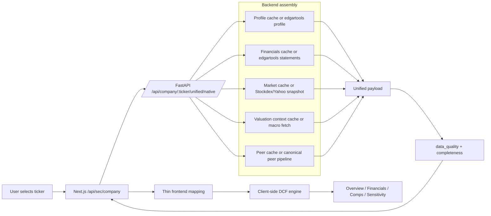

# DCF Builder Architecture Flow

## Primary Valuation Load

The backend is now the source of truth for SEC/native recovery and normalization. The frontend no longer merges a separate financial fallback payload into the unified company response.

Primary load contents:

- `profile`
- `financials_native`
- `market`
- `market_context` and `valuation_context`
- `peers` as best-effort comparables
- `data_quality`
- `completeness`

`insider_trades` is intentionally not part of the critical render path.

## Optional Enrichments

Optional enrichments are allowed to fail without breaking the first valuation render.

- `peers` are soft-required. The backend returns the canonical peer set when available, but a missing peer response only degrades comparables and assumption seeding.
- `insider_trades` are lazy/optional. The unified payload marks them unavailable during first load instead of blocking render with placeholder Form 4 rows.

The intended runtime contract is:

- first paint depends on financials, profile, market snapshot, and valuation context
- peers improve the experience but do not gate the valuation shell
- insider activity is loaded later or kept absent

## Export Path

Export defaults:

- historicals come from the UI snapshot
- assumptions come from the UI snapshot
- results come from the UI snapshot
- comps come from the UI snapshot
- transactions and overrides come from the UI snapshot

The backend does not re-enrich peers by default anymore. A live peer refresh is allowed only when the frontend sends `uiMeta.preferLivePeerFetch = true`.

## Fallback And Data Quality Matrix

The backend attaches `data_quality` per component:

- `financials`
- `market`
- `valuation_context`
- `peers`
- `insider_trades`

Each entry exposes:

- `status`: `live | cached | stale | default | unavailable`
- `source`
- `fetched_at_ms`
- `fallback_used`
- `notes`

The backend also attaches `completeness`:

- `has_financials`
- `has_market`
- `has_valuation_context`
- `has_peers`
- `has_insider_trades`
- `degradation_level`

Frontend behavior:

- keeps an in-memory company cache for speed
- deduplicates in-flight company loads
- surfaces explicit loading and error states
- shows degraded-input messaging from `completeness` and `data_quality`

Removed from the primary path:

- frontend merge of `/financials/native` into unified payload
- extra stale-cache rescue after mapping failure in `useCompanyData`
- separate treasury and ERP requests for the main company valuation load

## Where It Can Break

The current runtime can still degrade in these places:

- edgartools profile lookup fails for an invalid ticker
- edgartools statements are missing or materially incomplete
- market snapshot providers return no usable price / market cap
- macro fetch falls back to defaults
- peer enrichment times out or returns symbol-only fallbacks

The contract is to return a best-effort unified payload plus explicit degradation metadata, not to silently patch over contract failures in the frontend.

## Recommended Simplified Architecture

1. Backend composes the unified company payload from independently cached subcomponents rather than caching one mixed-TTL unified blob.
2. edgartools remains the primary SEC/native profile and statement source.
3. `get_financials()` remains supplemental for key metrics, not the main historical transport.
4. Frontend stays responsible for interactivity and DCF math, but not SEC/native recovery.
5. Export uses the exact visible model state unless the user explicitly opts into backend peer refresh.

## Runtime Ownership

Frontend owns:

- search UX and route transitions
- thin mapping from standardized backend payloads into app models
- client-side DCF calculation
- scenario controls, overrides, diagnostics, and presentation

Backend owns:

- edgartools profile and statement retrieval
- valuation-context assembly
- peer selection and enrichment contract
- data recovery boundaries
- provenance / completeness metadata
- SQLite-backed subcomponent caching
- final workbook generation

## Notes On Sources

- `edgartools` is the primary financial/profile source.
- `Company.income_statement()`, `balance_sheet()`, and `cashflow_statement()` remain the primary historical statement path.
- `Stockdex` with Yahoo fallback supplies market snapshots.
- macro assumptions are canonicalized in the backend unified payload.
- insider trades are optional and should not block the initial DCF render.
